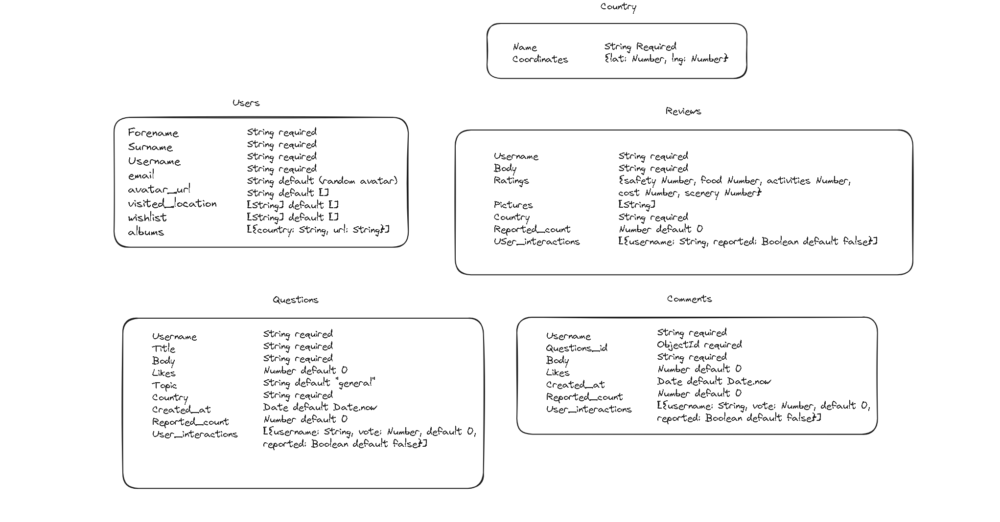
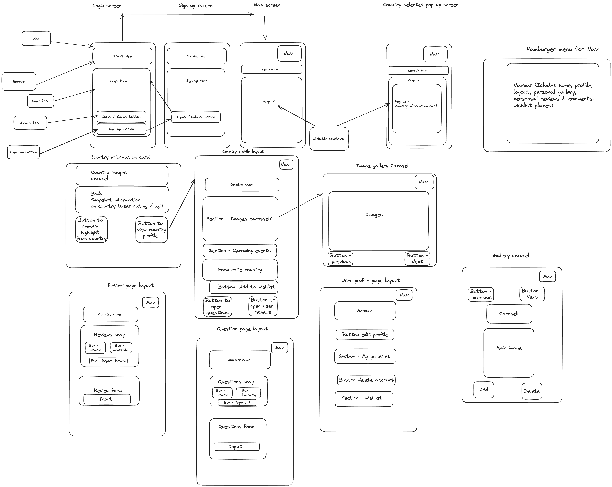

# Travel-app

## About the project

We decided to create a travel companion mobile app that provides information about different countries, allowing logged in users to view information about different countries, selecting countries from a map. Users can add countries to their wish list for countries they want to visit. There is also a user forum where users can post reviews and questions about that country as well as uploading photos.

Target audience is people who want to travel around the ages of 18-40.

When you do your research for a trip online, the information you get is often biased, with content creators often incentivised to promote certain products and activities. We have designed an app that tries to eliminate this bias by focussing on the experiences of other travelers and creating a well-informed and connected travel community. To the best of our knowledge, there isn’t an app that places such a strong emphasis on this.

The API is available here: [Go to the API](https://travel-app-api-8nj9.onrender.com/api)  
The App is available here: [Go to the Travel App](https://travel-app-npm-jog.netlify.app/)

 <div align="center"><br/>
 <p>Developed with: </p>

  


</div>

## Database : MongoDB + Typescript

### About Database

We decide to use mongodb as it is a non-relational database, which is different from PSQL that we see during the bootcamp. We couple it to TypeScript to improve the maintenance and the code quality.

Database schema :



### DATABASE SETUP

Before starting setup:

```bash
cd backend
```

#### INSTALL Package

install necessary packages :

```bash
npm i
```

#### CREATE .env files

We need 3 .env files for the 3 databases :

.env.development  
.env.production  
.env.test

in the server folder

in .env.development :

```JS
DATABASE_URL=<YOUR_DB_URL_CONNECTION>/travel-app-dev
```

in .env.production :

```JS
DATABASE_URL=<YOUR_DB_URL_CONNECTION>/travel-app-prod
```

in .env.test :

```JS
DATABASE_URL=<YOUR_DB_URL_CONNECTION>/travel-app-test
```

#### RUN the scripts

multiple scripts exist:

npm run seed : will create and seed the dev database  
npm run seed-prod: will create and seed the prod database  
npm run tests: will run the jest tests

(no script for test database as it will be created at the launch of tests)

## API: Express + Typescript

For the API we decide to use Express as we were familiar with it and couple it to Typescript for more robust code.

### SERVER SETUP

Before starting setup:

```bash
cd backend
```

#### INSTALL Packages

if not done for db install necessary packages :

```bash
npm i
```

#### Build

need to create a build before starting the server:

```bash
npm run build
```

### Run the server

if the build is successfull:

```bash
npm run dev
```

your server should be up and running !

## Frontend : Ionic + Vue

We decided to use Vue as our main frontend framework. Vue provided us with a different front-end framework from what we had all used previously, allowing us to learn and apply new skills to our project.

We paired it with Ionic which is a native component library which provides pre-styled elements for mobile applications.

We also used Typescript as our programming language as it is the language Vue is built on.

Client Wireframe:



### Frontend setup

Before starting setup:

```bash
cd frontend/TravelApp
```

#### INSTALL Package

install necessary packages :

```bash
npm i
```

#### Create API KEY

in the src/components folder :

- create a APIKey.js file
- add this :

```JS
const apiKey = { mapsKey: YOUR_GOOGLE_MAPS_KEY };

export default apiKey;
```

#### Run the client

to run the client you need to type:

```bash
ionic serve
```
